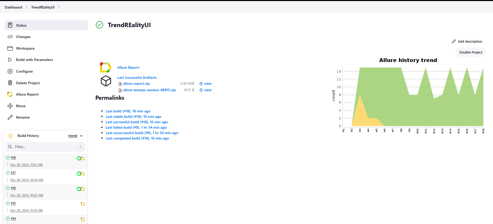
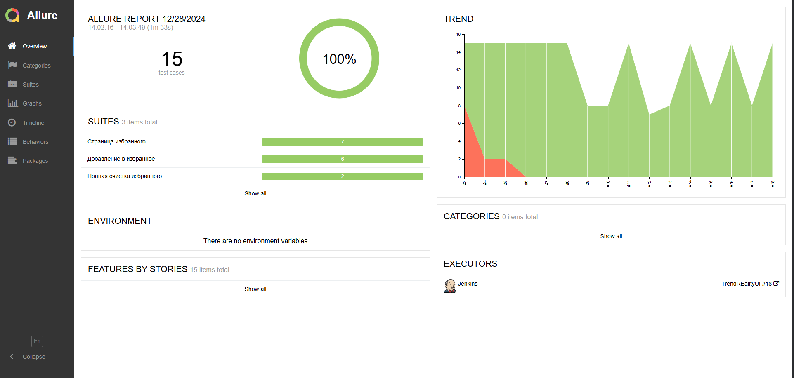
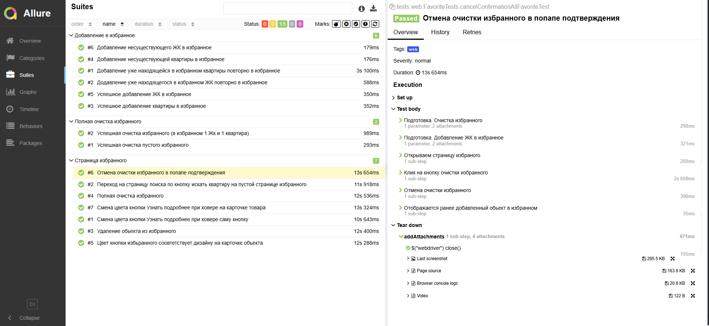
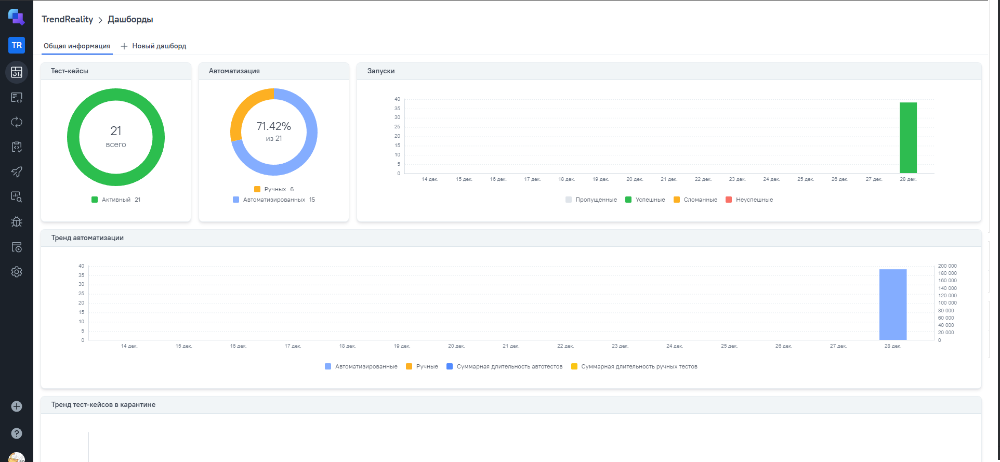
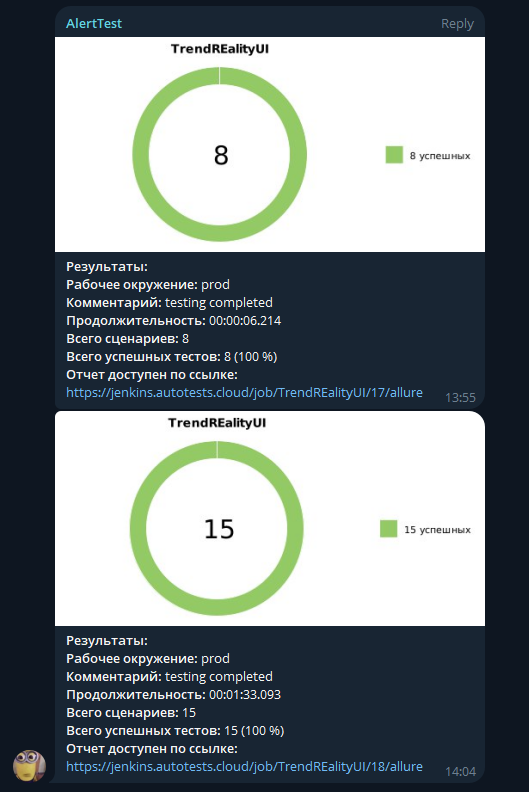

<h1>Проект автоматизации тестирования <a target="_blank" href="https://trendrealty.ru"> Trendrealty.ru </a> </h1>

## Содержание
+ [Реализованные проверки](#Реализованные-проверки)
+ [Запуск тестов](#Запуск-тестов)
+ [Cборка тестов в Jenkins](#Cборка-тестов-в-Jenkins)
+ [Интеграция с Allure Report](#интеграция-с-allure-report)
+ [Интеграция с Allure TestOps](#Интеграция-с-Allure-TestOps)
+ [Уведомления в Telegram с использованием бота](#Уведомления-в-Telegram-с-использованием-бота)


## Реализованные проверки
### Web
- [x] Пустая страница избранного
- [x] Отображение и взаимодействие с кнопками обьектов
- [x] Удаление избранного
- [x] Попап подтверждения очистки избранного

### Api
- [x] Полная очистка избранного
- [x] Добавление обьектов в избранное

### Ручные проверки:
- [x] Отображение блоков в футере

## Запуск тестов
### Локальный запуск тестов
#### Запуск всех тестов

Для запуска следует открыть IntelliJ IDEA и выполнить в терминале:
```
gradle clean test
```

#### WEB

```
gradle clean web
```


#### API
```
gradle clean api 
```


## Cборка тестов в <b><a target="_blank" href="https://jenkins.autotests.cloud/job/TrendREalityUI/">Jenkins</a></b>

>Для запуска сборки необходимо перейти в раздел `Build with Parameters` и нажать кнопку `Build`




## Интеграция с <b><a target="_blank" href="https://jenkins.autotests.cloud/job/TrendREalityUI/22/allure/">Allure report</a></b>
#### Диаграммы прохождения тестов
`ALLURE REPORT` - отображает дату и время теста, общее количество запущенных тестов, а также диаграмму с процентом и количеством успешных, упавших и сломавшихся в процессе выполнения тестов <br/>
`TREND` - отображает тенденцию выполнения тестов для всех запусков <br/>
`SUITES` - отображает распределение тестов по сьютам <br/>



#### Развернутый результат прохождения тестов:
1. `Suites` - Общий список автотестов
2. `Test body`- Содержание автотеста
3. `Tear Down` - Вложения (в этом блоке отображается последний скриншот а так же видео прохождения теста)

   


## Интеграция с <b><a target="_blank" href="https://allure.autotests.cloud/project/4541/dashboards">Allure TestOps</a></b>

>Диаграммы прохождения тестов 
>



## Уведомления в Telegram с использованием бота

> Бот, созданный в Telegram, после завершения сборки отправляет сообщение с отчетом о прохождении тестов
>



